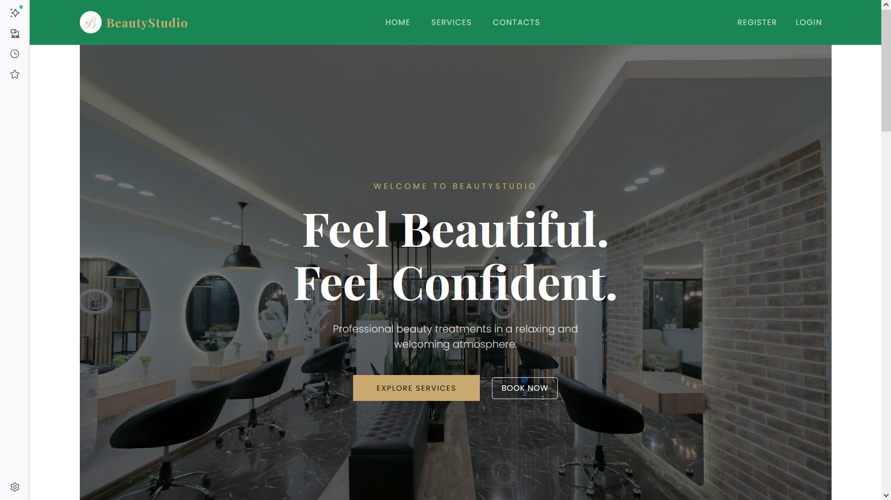
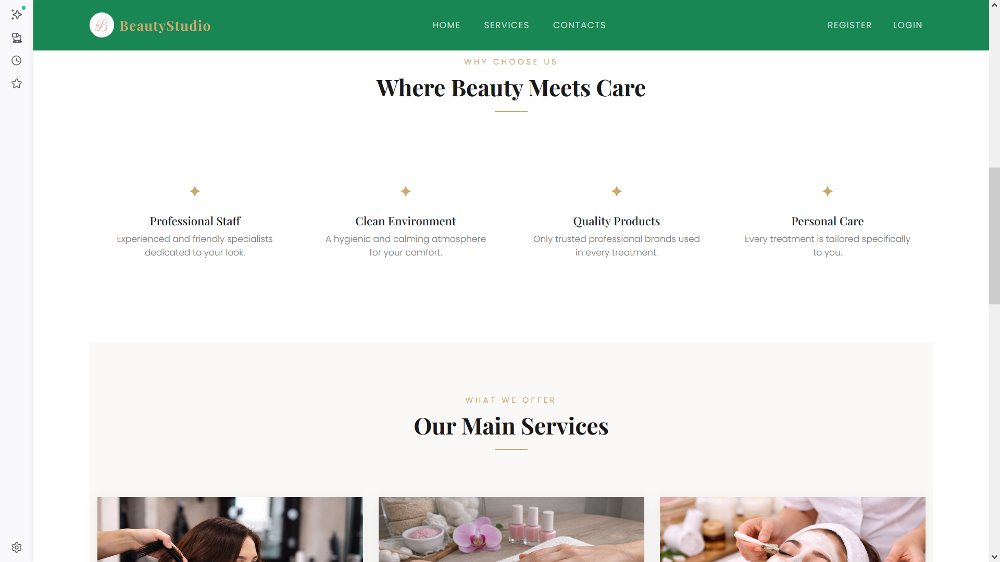
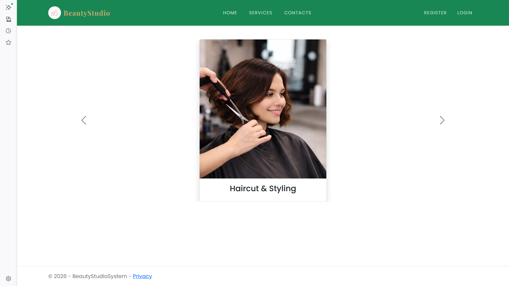
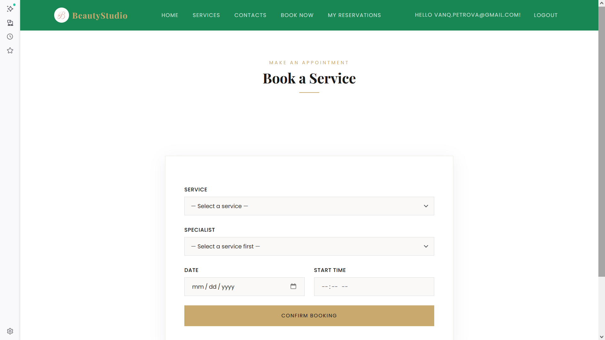
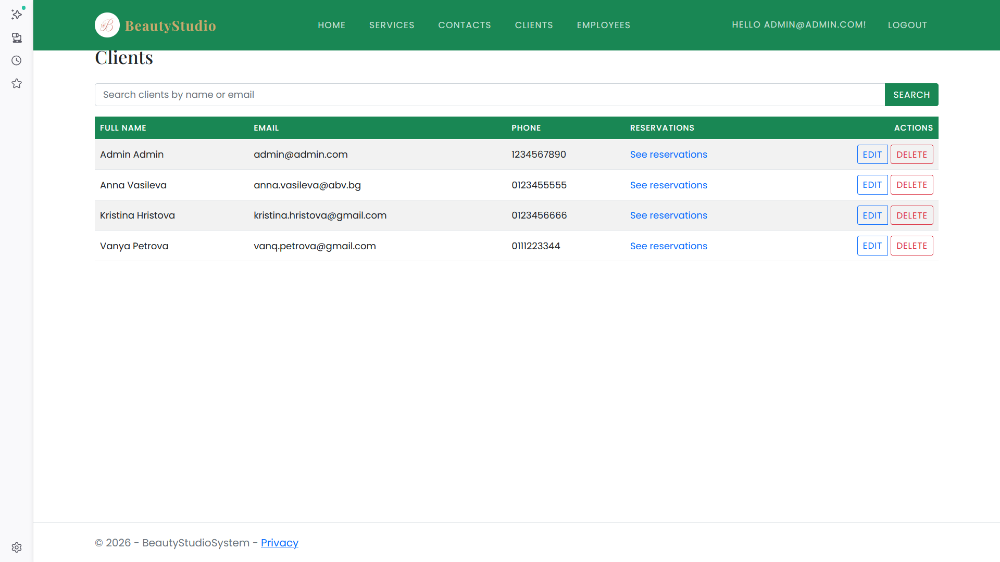
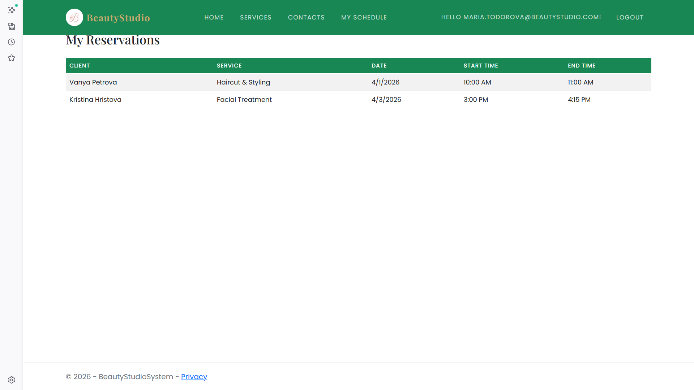
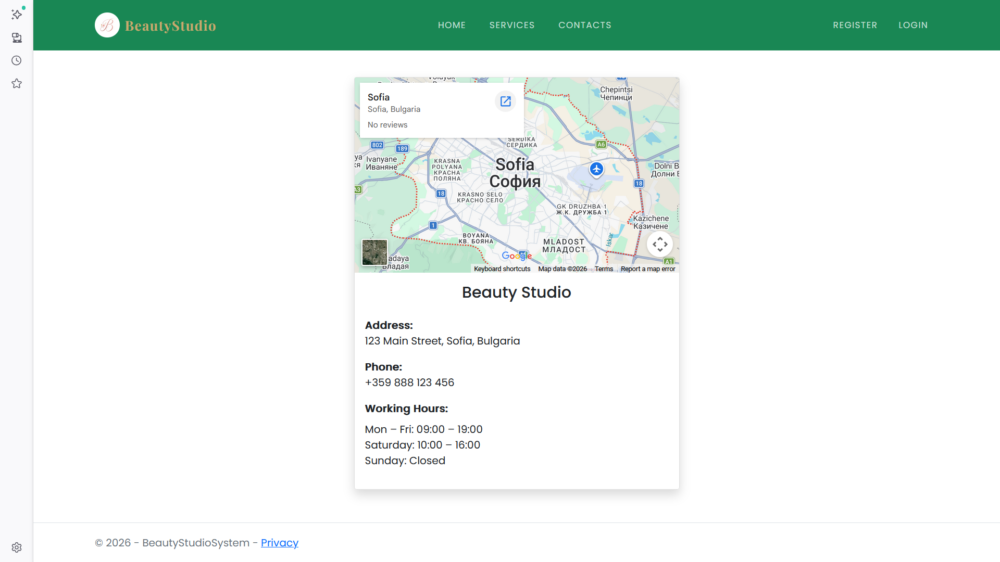

# 💅 BeautyStudioSystem

A web application for beauty studios and salons to manage reservations, employees and services. The idea came from the need to digitize the work of a receptionist — clients can book appointments online, employees can check their schedule, and the studio owner can manage everything from one place.

---

## 📋 Table of Contents

- [About the Project](#about-the-project)
- [Features](#features)
- [Technologies Used](#technologies-used)
- [Project Structure](#project-structure)
- [Entity Models](#entity-models)
- [Seeded Data](#seeded-data)
- [Setup Instructions](#setup-instructions)
- [Test Coverage](#test-coverage)
- [Deployment](#deployment)
- [Screenshots](#screenshots)

---

## 🌸 About the Project

BeautyStudioSystem is built for small to medium beauty studios. Instead of calling to book an appointment, clients can register, browse services, pick a specialist and choose a time slot. The system handles the rest — it checks if the employee is available and prevents double bookings.

Studio owners get an admin panel where they can manage clients, promote users to employee roles, track reservations and manage the service catalog.

---

## ✨ Features

### For Clients
- Register and log in
- Browse services and service categories
- Book a reservation — choose a service, pick an employee that specializes in it, select a date and time
- View and cancel their own reservations

### For Employees
- View their personal reservation schedule

### For Admins
- Manage clients — search, paginate, edit, delete
- Promote a client to Employee or revert an employee back to a client
- Manage employees — edit details, assign service specializations
- View reservations per client and per employee
- Manage services and service categories

---

## 🛠️ Technologies Used

- ASP.NET Core MVC (.NET 8)
- Entity Framework Core
- Microsoft SQL Server
- ASP.NET Core Identity
- Razor Views
- Bootstrap 5
- Toastr.js
- jQuery
- NUnit + Moq (unit testing)

---

## 🏗️ Project Structure

The solution is split into 4 projects:

- `BeautyStudioSystem` — the main web project (controllers, views, areas)
- `BeautyStudioSystem.Core` — services, view models, service interfaces
- `BeautyStudioSystem.Data` — EF Core models, repositories, DbContext, seeder
- `BeautyStudioSystem.Tests` — unit tests

Admin functionality is separated into an MVC Area (`Areas/Admin`) 

---

## 🗃️ Entity Models

The application has 5 main entity models:

- **Client** — a registered user with the Client role
- **Employee** — a studio worker linked to an Identity user, can have multiple service specializations
- **Service** — a beauty service with a name, price, duration and category
- **ServiceCategory** — groups services (e.g. Hair, Nails, Face)
- **Reservation** — links a client, employee and service with a date, start time and end time

---

## 🌱 Seeded Data

The database is seeded automatically on first run with the following accounts:

| Email | Password | Role |
|---|---|---|
| admin@admin.com | Admin123! | Admin |
| vanq.petrova@gmail.com | Client123! | Client |
| anna.vasileva@abv.bg | Client123! | Client |
| kristina.hristova@gmail.com | Client123! | Client |
| maria.todorova@beautystudio.com | Employee123! | Employee |
| elena.georgieva@beautystudio.com | Employee123! | Employee |

Also seeded: 3 service categories, 3 services, employee specializations and 3 sample reservations.

---

## 🚀 Setup Instructions

### Requirements
- .NET 8 SDK
- SQL Server or LocalDB
- Visual Studio 2022

### Steps

1. Clone the repo:
```bash
git clone https://github.com/yourusername/BeautyStudioSystem.git
```

2. Set your connection string in `appsettings.json`:
```json
"ConnectionStrings": {
  "DefaultConnection": "Server=(localdb)\\mssqllocaldb;Database=BeautyStudioSystemDb;Trusted_Connection=True;"
}
```

3. Apply migrations:
```bash
dotnet ef database update
```

4. Run the project. The database will be seeded on first startup.

5. Log in with the admin account:
   - Email: `admin@admin.com`
   - Password: `Admin123!`

---

## 🧪 Test Coverage

Unit tests are written with **NUnit** and **Moq** and cover the main service methods including happy paths and edge cases.
---

## 🤖 AI Assistance

Parts of this project were developed with the help of AI tools:

- **Views** — Razor views were generated or scaffolded with AI assistance and then reviewed and adjusted
- **README** — this documentation file was written with AI assistance

---


## 📸 Screenshots








---

## 👩‍💻 Author

Final project for the **ASP.NET Advanced** course at **SoftUni**.